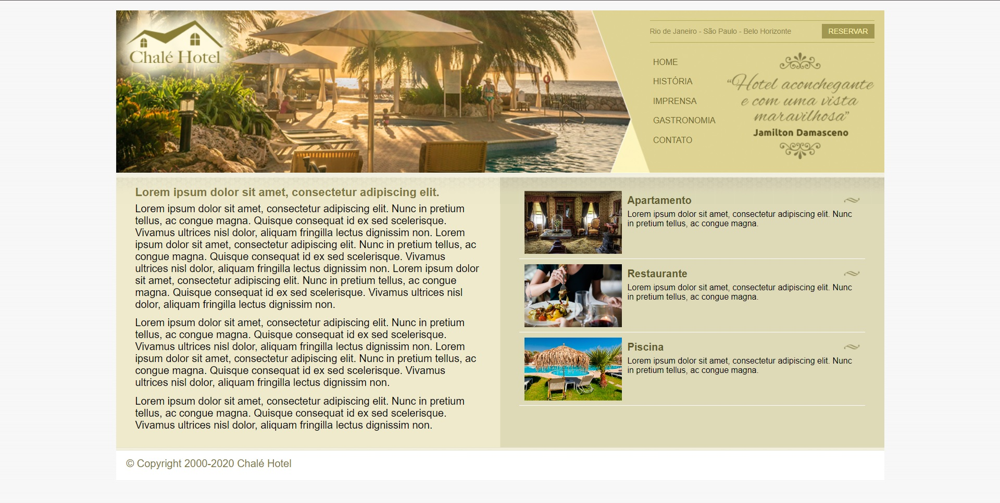

<h1 align="center"> Chalé hotel </h1>

A pousada perfeita para passar um final de semana ou até suas férias com aquela pessoa especial para você.

 

  

## ✔ Tecnologias

Esse projeto foi desenvolvido com as seguintes tecnologias:

- HTML e CSS
- Git e Github

## 💻 Projeto

O site do Chalé hotel é um site construido para fins didáticos, iniciando com as técnologias HTML e CSS

